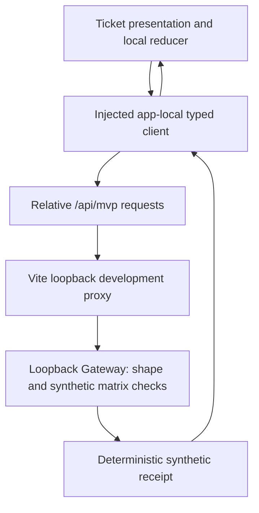

# MVP-04 Architecture Preflight

Minimal Local BFF and Synthetic Persona Boundary. Planning only; all runtime
behavior below is a future implementation requirement, not an executed result.

## 1. Executive decision

**CHOSEN_TOPOLOGY: A.** One app-local typed client and one loopback Gateway are
sufficient. Child workspaces change from **1 to 2**. `packages/api-client` is
intentionally deferred because only workspace-web consumes the client.

**Preflight disposition: READY_FOR_IMPLEMENTATION.** `MVP04-GOV-01` is
`RESOLVED`: the required explicit Dependency Policy ownership and review rule
is present in both byte-identical ownership mirrors on the rebound governance
main. No canonical architecture change is needed. This disposition does not
start MVP-04; it makes only MVP04-I01 eligible after this resumed Preflight is
committed, reviewed through GitHub, merged to main and main CI succeeds.

## 2. Current repository baseline

Read current root instructions, public boundary, contribution rules, manifests,
Vite config, App/tests/source-contract, all Ticket/Card/Thread/Timeline/Canvas
sources and tests, ADRs 0002/0004/0009, target/security/event/person/UX models,
dependency policy/rules, both ownership files, both workspace/DAG checkers and
tests, overlay/acceptance, and HW-02/HW-05/HW-06 task YAML. Their canonical
identity, domain and acceptance requirements remain authoritative.

Resume starting binding on 2026-09-05:

- Branch: `mvp/mvp-04-architecture-preflight`; index empty; exactly the four
  authorized Preflight planning paths are present in the working tree.
- HEAD and refreshed `origin/main` agree with the resume base in section 3.
- Governance [PR #13](https://github.com/peterkis/hospital-workspace/pull/13)
  is merged; its main CI completed successfully on the exact resume commit.
- Overlay is active: `currentSlice: MVP-04`, `currentSliceState: not-started`.
- No Gateway or api-client workspace exists. No nested instruction file applies
  to the four planning paths; the nested-agents directory contains templates.
- F0 remains the previously accepted foundation Gate, not service acceptance.
- P2-F0-01 stays owned by `toolchain-owner`, due `2026-09-16`, required before
  `2026-09-23`: four Node20-declaring Actions need reviewed Node24-native SHA
  pins. This task does not change or defer it.

## 3. Current main commit and tree

| Binding | Value |
| --- | --- |
| Source main commit | `62e9724da85651a3f594cb698f5ddb820b0288ec` |
| Source main tree | `2e25be26d2fe125d30b09a806c81baf4bac79cb6` |
| Main merge | Governance PR #13; implementation `970369d613cbb7da0eb2a532479690007b963612`; merge `62e9724da85651a3f594cb698f5ddb820b0288ec` |
| Main CI | Run `33931625052`; completed/success; head SHA `62e9724da85651a3f594cb698f5ddb820b0288ec` |
| Result binding | Final staged tree in parent-session review receipts; never self-embedded |

Historical provenance is retained:

| Run | Commit | Tree | Result |
| --- | --- | --- | --- |
| Initial Preflight base | `a427fd99067bf593db17ba8e29dd0c981a1c9815` | `11efc1685b4deb95d78e749346f852776e3758c9` | Candidate staged tree `c26c0ad7dd2fe2b70dce7a3037fd542e770d5ca6`; `BLOCKED` by `MVP04-GOV-01` |
| Resume base | `62e9724da85651a3f594cb698f5ddb820b0288ec` | `2e25be26d2fe125d30b09a806c81baf4bac79cb6` | Governance correction present; new result tree must be frozen after validation |

## 4. Existing workspace inventory

`pnpm-workspace.yaml` registers exactly `apps/workspace-web`, package
`@hospital/workspace-web`. Root is the tooling workspace, excluded from the
child count. Gateway is already classified as `platform-service` by policy;
that is a target classification, not an existing implementation. Current
platform-service external allowlist is exactly `[fastify]` and applies equally
to runtime and dev dependencies. Current browser product scanning prohibits
fetch, XMLHttpRequest, WebSocket and EventSource everywhere it scans.

MVP-03's `useSyntheticTicketRuntime` queues commands, waits 180 ms and dispatches
`settle`; `syntheticTicketReducer` owns only a local demonstration projection.
It maintains a local receipt ledger, deduplicates command ID or key, checks
version/transition, then adds one local event and version. Existing tests cover
the eight transitions, rejection matrix, cancellation, focus and reset. Preserve
those observable results when replacing Ticket's timer with HTTP. The separate
MVP-02 Card simulation remains local, with no new API or feature edits.

## 5. Topology comparison

| Option | Shape | Child count | Decision |
| --- | --- | ---: | --- |
| A | workspace-web -> app-local platform/api -> Vite proxy -> Gateway | 2 | Selected: one present client; current layers and same-origin direction suffice |
| B | workspace-web -> api-client -> app-local platform/api -> Gateway | 3 | Rejected: no present second consumer or constraint; SDK adds build/ownership/indirection without need |
| C | browser -> different-origin Gateway | 2 | Rejected: unnecessary browser API origin and CORS; diverges from accepted same-origin direction |

`REJECTED_TOPOLOGIES: [B, C]`. Neither a target directory in AGENTS nor the old
overlay's broad api-client path proves a present SDK requirement.

## 6. Selected topology

Future child manifests are exactly `apps/workspace-web/package.json` (unchanged)
and `services/gateway/package.json` (new). No SDK, canonical contract, repository
or database workspace is created. Gateway does not import browser modules; the
browser does not import Gateway, Fastify or Node runtime modules.

## 7. Request flow



No production domain event, storage transaction or identity authority is hidden
behind this diagram.

## 8. Read flow

Entering the normal Ticket experience loads bootstrap for the selected persona.
The typed client exposes `readBootstrap(persona, signal)` and
`sendCommand(envelope, signal)` only; there is no generic request or endpoint
argument. `persona` is a runtime-validated `reporter | engineer`. The bootstrap
request uses one fixed literal URL per persona. It returns the descriptor and
one fixed Ticket capability entry. It never returns the Ticket aggregate.

The Ticket runtime owns loading/error/ready presentation, not transport. App
creates/injects the client once and remains a composition root. No command is
enabled before valid bootstrap for the currently displayed persona. Switching
persona aborts/invalidates stale bootstrap and pending command work, then loads
the new descriptor; Ticket projection itself remains shared in that browser.
Thread change, scenario reset and unmount also invalidate outstanding requests.
Use a monotonically incremented in-memory generation so an A -> B -> A switch
cannot revive an old response. Transport failure shows retryable unavailability
without replacing bootstrap with a successful local fixture.

## 9. Command flow

1. Ticket capability creates the existing local command and captures Ticket ID,
   selected persona, observed local version, and context generation.
2. A narrow adapter maps `commandType` to wire `action`, actor to `personaId`,
   and sends only the envelope in section 13. No title, description, attachment,
   timestamp, role or scope is submitted.
3. Queue/deduplicate synchronously in memory, show pending, then call the
   injected client. No Ticket settlement timer or offline-success fallback.
4. Gateway validates route, method, headers, JSON shape and fixed persona/action
   rules. It compares submitted expectedVersion with submitted observedVersion.
5. Typed client validates status/body/marker/fields and exact echoed command ID,
   key and versions before delivering a receipt. Wrong or extra fields fail.
6. The local reducer verifies the pending command, generation, captured actor,
   current local version and existing local transition table. Only a matching
   accepted receipt can advance that temporary projection once. An invalid
   local transition still fails even if the stateless Gateway accepted the
   envelope. Preserve the wire receipt separately from the local application
   outcome; never relabel a local failure as a Gateway rejection.
7. Timeline rows keep synthetic command provenance and fixed Asia/Shanghai
   display times. Local demo event IDs never come from Gateway and never become
   production domain events.

`receipt.accepted` does **not** mean domain completed. The production rule in
EVENT-COMMAND-PROTOCOL.md remains: a domain event confirms final state. Gateway
cannot know whether a submitted version or claimed persona is true.

## 10. Authority matrix

| Concern | MVP-04 responsibility | Authority limit |
| --- | --- | --- |
| Ticket projection, lifecycle display, local version | Browser Ticket reducer | Temporary demonstration only |
| HTTP request/response shape | Gateway and typed client | Prototype transport validation |
| Persona/action matrix, descriptors | Fixed Gateway constants | Freely selectable synthetic constraints |
| Command receipt | Stateless Gateway function | No durable acknowledgement or domain completion |
| Duplicate suppression | Browser receipt ledger | One mounted local runtime only |
| Ticket aggregate truth | No implemented authoritative service in MVP-04 | Reserved for services/tickets |
| Authentication, Principal, Authz, Scope, Session | Unimplemented | Canonical HW-02 boundary unchanged |
| Domain events, Outbox and persistence | Unimplemented | Canonical domain/service boundary unchanged |

## 11. Synthetic persona matrix

Exactly two personas; descriptors use `synthetic: true`. Arrays have the fixed
order shown. Labels continue the existing MVP-03 presentation.

| Persona / personaId | displayName | roles | scopes | Allowed command actions |
| --- | --- | --- | --- | --- |
| reporter / synthetic-persona-reporter | Synthetic Reporter | reporter | tickets:read, tickets:submit, tickets:close, tickets:reopen | submit, confirm_close, reopen |
| engineer / synthetic-persona-engineer | Demo IT Engineer | engineer | tickets:read, tickets:triage, tickets:assign, tickets:accept, tickets:progress, tickets:resolve | triage, assign, accept, start_progress, resolve |

`start_progress -> tickets:progress`; `confirm_close -> tickets:close`. Keep
existing action names; do not introduce synonymous commands. Scope strings
here are not the canonical `none/all/restricted` security Scope type.
All API responses carry `synthetic: true` and `boundary: local-prototype`.
Bootstrap additionally carries a fixed notice explaining unauthenticated
persona presentation. The visible Ticket UI repeats that notice alongside
`PUBLIC-SYNTHETIC · 非生产原型 · Asia/Shanghai`, role and scope labels. A hidden
screen-reader-only explanation is insufficient. No login, access-granted or
session-restored wording is permitted.

## 12. API endpoint table

| Method and path | Input | Success/output | Purpose |
| --- | --- | --- | --- |
| GET /healthz | No query/body | 200: status=ok, synthetic=true, boundary=local-prototype | Direct loopback process health, not dependency readiness; not proxied or fetched by product UI |
| GET /api/mvp/bootstrap | Exactly one persona query, reporter or engineer | 200: descriptor, fixed Ticket capability, markers and notice | Synthetic presentation read |
| POST /api/mvp/commands | JSON envelope only; no query | 200 accepted/rejected or 409 conflict receipt | Stateless synthetic receipt |

No receipt lookup, Ticket read/write route, login, auth/session route, refresh,
SSE or wildcard proxy API. Unknown routes return 404. Other methods on these
three paths return 405, including HEAD and OPTIONS; disable implicit HEAD.

## 13. Frozen request and response examples

Bootstrap reporter response (engineer follows the exact matrix above):

```json
{
  "synthetic": true,
  "boundary": "local-prototype",
  "notice": "Synthetic persona presentation only; no authentication, authorization or Session.",
  "persona": {
    "personaId": "synthetic-persona-reporter",
    "displayName": "Synthetic Reporter",
    "roles": ["reporter"],
    "scopes": ["tickets:read", "tickets:submit", "tickets:close", "tickets:reopen"],
    "synthetic": true
  },
  "capabilities": [{
    "capabilityId": "tickets",
    "label": "Synthetic Tickets",
    "actions": ["submit", "confirm_close", "reopen"],
    "synthetic": true
  }]
}
```

Command request:

```json
{
  "ticketId": "demo-ticket-workstation-output-001",
  "action": "submit",
  "commandId": "demo-ticket-command-submit-v1-a1",
  "idempotencyKey": "demo-ticket-idempotency-submit-v1-a1",
  "expectedVersion": 1,
  "observedVersion": 1,
  "personaId": "synthetic-persona-reporter"
}
```

Accepted receipt:

```json
{
  "commandId": "demo-ticket-command-submit-v1-a1",
  "idempotencyKey": "demo-ticket-idempotency-submit-v1-a1",
  "state": "accepted",
  "expectedVersion": 1,
  "observedVersion": 1,
  "reason": "SYNTHETIC_ENVELOPE_ACCEPTED",
  "synthetic": true,
  "boundary": "local-prototype"
}
```

All objects reject additional properties. Request requires exactly the seven
listed fields, with optional `correlationId` only. Ticket ID is the one fixed
fixture ID. `action` is one of the eight matrix actions; personaId is one of
the two literal IDs. Versions are integers from 0 through 1000000 (0 preserves
the initial stale-version demonstration). Command ID and key have maximum
length 128 and respectively match `^demo-ticket-command-[a-z0-9_-]+$` and
`^demo-ticket-idempotency-[a-z0-9_-]+$`. Optional correlationId has maximum length
64 and matches `^synthetic-correlation-[a-z0-9-]+$`; only a validated supplied
value is echoed. There is no generated correlation ID or clock/random field.

Decision precedence after HTTP/shape validation: unknown persona -> 400 error;
unknown action -> 400 error; known disallowed persona/action -> 200 rejected
with `PERSONA_ACTION_MISMATCH`; allowed action with unequal versions -> 409
conflict with `VERSION_CONFLICT`; otherwise -> 200 accepted with
`SYNTHETIC_ENVELOPE_ACCEPTED`. Schema validation errors for the persona/action
enum fields map to those specific error codes only after structural validity
is established; use attachValidation or equivalent native error inspection,
never return raw validation details. Rejected/conflict receipts echo the same
validated metadata and markers as accepted. Fixed reason strings are enums,
not interpolated request data. Identical valid envelopes give identical JSON
values across requests and process restarts. Changed content with a reused key
is evaluated anew: there is intentionally no server idempotency authority.

## 14. Failure model

Public-safe error example:

```json
{
  "code": "INVALID_REQUEST",
  "message": "Invalid synthetic request.",
  "synthetic": true,
  "boundary": "local-prototype"
}
```

| Failure | HTTP / result | Browser behavior |
| --- | --- | --- |
| Missing/extra fields, wrong primitive, invalid bounds/query/header | 400 INVALID_REQUEST | No projection change; bounded fixed notice |
| Unknown persona/action | 400 UNKNOWN_SYNTHETIC_PERSONA / UNKNOWN_ACTION | Fail closed; never use default persona/action |
| Known persona/action mismatch | 200 rejected receipt | Show synthetic rejection; no transition |
| Submitted versions unequal | 409 conflict receipt | Show supplied versions; refresh local context, then explicit new attempt |
| Unknown route / wrong method | 404 NOT_FOUND / 405 METHOD_NOT_ALLOWED | Fixed error; no route fallback |
| Non-JSON command / over 4096 bytes | 415 UNSUPPORTED_MEDIA_TYPE / 413 REQUEST_TOO_LARGE | No command handling |
| Internal exception | 500 INTERNAL_ERROR | No stack/body/path disclosure |
| Gateway unavailable via Vite | 502 LOCAL_GATEWAY_UNAVAILABLE | Fixed proxy error; no offline acceptance |
| Fetch timeout / abort / network failure | Client TIMEOUT / CANCELLED / UNAVAILABLE | Preserve projection and receipt history; clear pending; explicit retry |
| Invalid response, unexpected status, redirect, mismatched metadata | Client INVALID_RESPONSE | Quarantine response; never apply it |
| Local context/version changes after valid acceptance | Local application conflict/cancel | Keep wire receipt distinct; do not apply or claim server rejection |

Messages for all server/proxy codes are fixed public-safe strings; no raw
request, framework message, stack, local path, environment or host topology is
returned. Optional validated correlationId uses the bounds above. Client
timeouts are 5000 ms using AbortController and cleared timers; requests use
`credentials: omit`, `redirect: error`, `cache: no-store`, `mode: same-origin`.
Only Accept and command Content-Type headers are authored. Responses must be
JSON, at most 8192 bytes, and match the strict discriminated shape and expected
HTTP status. Bound the response reader; Content-Length alone is insufficient.
Do not display arbitrary server messages or treat HTTP 200 as acceptance.
No automatic command retry; retry reuses the frozen envelope after a transport
failure, while local duplicate suppression ensures at most one application.
A resolved rejection/conflict requires a new command ID and key. No generic
production error taxonomy is created.

## 15. Source-boundary design

Extend product scanning to all `src/**/*.{ts,tsx}` excluding tests and explicit
test setup. Keep format scanning intact. Classify by normalized relative path,
not substring. Only `src/platform/api/mvp-api-client.ts`, inside
`src/platform/api/**`, contains direct global `fetch(...)` calls. No feature,
capability, App, fixture, type or error module receives a fetch exemption.

Keep the existing prohibitions on other transports, persistence, unsafe HTML,
dynamic imports/code, native/server runtime, files/uploads and nondeterministic
business time/IDs. Production types/errors contain no absolute URL. Client
transport accepts no endpoint or generic RequestInit/header input. Permit
exactly three fetch target literals: `/api/mvp/bootstrap?persona=reporter`,
`/api/mvp/bootstrap?persona=engineer`, `/api/mvp/commands`. Branch on validated
persona; do not construct an arbitrary target. Reject absolute/protocol-relative
URLs, traversal, dynamic targets, fetch aliases/property indirection and
credential/header overrides. This bounded source rule is a regression guard,
not a sandbox or proof against malicious JavaScript.

Positive and negative snippets live in `source-contract.test.ts`: each allowed
literal in the transport passes; the same call in Ticket/features/App fails;
absolute HTTP/HTTPS, arbitrary argument, prefix lookalike, template-generated
host, alias/property fetch, XMLHttpRequest/WebSocket/EventSource and persistence
fail. Test runtime guards against invalid persona and unexpected wire data too.
No AST/parser dependency is added; use an intentionally narrow recognizable
transport form and fail on any other fetch reference. The TypeScript runtime's
timeout is infrastructure timing, not business timestamps or random IDs.

## 16. Same-origin and Vite proxy design

Freeze Vite host `localhost`, port `5173`, `strictPort: true`,
`allowedHosts: [localhost]`, `cors: false`. Freeze proxy key `^/api/mvp/`, target
`http://[::1]:3001`, no rewrite, `changeOrigin: false`, `ws: false`.
No variable/env/user destination or generic forwarding route. Do not proxy
healthz or other path prefixes. Vite's native proxy hooks strip Cookie,
Authorization, Proxy-Authorization and any `x-hospital-*` headers and normalize
proxy failure to the bounded 502 envelope. Product calls omit credentials.

Gateway accepts only Host `localhost:5173` (proxy) or `[::1]:3001` (direct
process diagnostics). Origin may be absent for local tools or exactly
`http://localhost:5173`; any other Origin, including null, is rejected. These
checks contain the demo; they do not authenticate the caller. No wildcard CORS
or Access-Control-Allow-Origin response. `trustProxy: false`. No external
network is required to run installed code. Vite's own local development module
and HMR traffic is not product fetch permission. `vite preview` is static-only
and is not the supported MVP-04 HTTP experience or a deployment method.

Gateway binds to IPv6 loopback `::1`, not a DNS-resolved destination. The
current public network scanner rejects numeric IPv4 loopback references; the
explicit IPv6 loopback topology satisfies the local-only requirement without
changing that rule or encoding an address. If IPv6 loopback is unavailable,
startup fails and implementation acceptance stops; no alternate address or
wildcard bind is allowed. Verify the actual IPv6 listener during I06.

`apps/workspace-web/vite.config.ts` is necessary and is the only added overlay
path. It is **not modified by this preflight**.

## 17. Gateway runtime design

`buildApp()` constructs Fastify and routes without listening; tests use
Fastify `inject()` and always close the instance. `src/server.ts` alone listens
on the fixed loopback address and handles SIGINT/SIGTERM with close-once
cleanup. Bind failure is a fixed public-safe message and nonzero exit, without
port fallback. No host/port CLI or environment override in this prototype.

Use native, static JSON Schema; no schema compiler framework or user schemas.
Require all fields and `additionalProperties: false`. Override Fastify's Ajv
defaults with `coerceTypes: false`, `removeAdditional: false`, `useDefaults:
false`; reject malformed data instead of fixing it. Reject duplicate bootstrap
query values and unknown query keys. JSON command media type is
`application/json` with optional UTF-8 charset only. Body limit is 4096 bytes,
request timeout 5000 ms. Set `logger: false`, no request/body/access logging,
and `exposeHeadRoutes: false`. Map all parser/validation/router errors through
the public-safe envelope. Responses use no-store and nosniff headers.

Runtime app code has no filesystem, database, Redis, shell, subprocess, outbound
HTTP, proxy, token, cookie or environment-secret operation. Node module loading
and package dependencies are not a claim of an OS sandbox. Test-only source and
format scans may read repository files; that permission does not enter runtime
handlers. No Ticket state is retained between requests.

## 18. Workspace, toolchain and root changes

Register exactly two quoted workspace paths; do not use wildcard registration.
Keep the root dependency set unchanged. Keep explicit root quality filters and
append `pnpm --filter @hospital/gateway run <same-script>` to build, lint,
typecheck, test and format:check. Retain existing root checker/compiler/tests
prefixes. Root `check` remains build && lint && typecheck && test, thereby
including Gateway transitively. Existing hosted checks already run all six
root routes plus DAG and Public Safety; no workflow change is required.

Gateway implements all six scripts, with no --if-present or no-op/N/A escape:

| Script | Planned command / behavior |
| --- | --- |
| build | `pnpm run typecheck` (native-source runtime needs no emitted bundle) |
| lint | `node --test test/source-boundary.test.ts` |
| typecheck | `tsc --project tsconfig.json --noEmit` using root-pinned compiler |
| test | `node --test test/*.test.ts` using Node's glob support, including injection tests |
| check | `pnpm run build && pnpm run lint && pnpm run typecheck && pnpm run test` |
| format:check | `node --test test/format.test.ts` (LF/final-newline/trailing whitespace and manifest JSON) |
| dev | `node src/server.ts` |

Gateway tsconfig extends root strict NodeNext/ES2024/noEmit; set
`erasableSyntaxOnly: true`, `verbatimModuleSyntax: true`,
`allowImportingTsExtensions: true`, `types: [node]`; include src and tests. Use
explicit `.ts` relative imports and `import type`. No enums, parameter
properties, runtime namespaces, import aliases, decorators, JSX/TSX, path aliases
or transform-types flag. Type stripping does not typecheck or read tsconfig.
The local Node 24.18.0 stdin erasable-TypeScript probe passed; installed tsc is
7.0.2. Actual Fastify service build/typechecking remains unexecuted.

Planned root development commands:

```text
dev:workspace = pnpm --filter @hospital/workspace-web run dev
dev:gateway = pnpm --filter @hospital/gateway run dev
dev:mvp = node scripts/governance/check-workspace-contract.mjs --validate && pnpm -r --parallel --filter @hospital/workspace-web --filter @hospital/gateway run dev
```

Use pnpm's native parallel execution, no third-party supervisor. There is no
startup-order guarantee; bootstrap loading/error/retry handles Gateway startup.
Ctrl+C and failed-start peer cleanup must be verified on Windows before later
implementation acceptance; do not claim native pnpm provides untested sibling
termination guarantees. If it leaves a peer alive, stop acceptance and seek a
bounded process-lifecycle correction instead of installing a supervisor.

## 19. Exact dependency changes required

| Package | Kind / owner workspace | Current policy | Required change and rationale |
| --- | --- | --- | --- |
| fastify | runtime / services/gateway | Allowed platform-service | One exact reviewed release, resolved during implementation; approved routing, JSON Schema, error handling and injection avoid hand-building them over node:http |
| @types/node | dev / services/gateway | Not allowed platform-service | Add only this name to platform-service allowlist, then exact reviewed 24.x pin; Node runtime does not ship TS declarations, and Fastify/Node tests need them |
| typescript 7.0.2 | existing root dev tool | Root exact set approved | No new manifest entry; pnpm exposes root tool binaries to workspace scripts |
| workspace-web / app-local client | none added | Existing frontend set | Native fetch, AbortController and existing Vitest/React suffice |

Fastify remains the **only runtime dependency**. No Express, CORS plugin,
Prisma, Redis, auth/session/cookie package, HTTP proxy library, logging package,
schema provider, tsx, ts-node, test runner or supervisor is added. The existing
lock's transitive `@types/node@26.4.1` is not used as an undeclared service
dependency or evidence of Node-24 API compatibility. Do not add type stubs,
ambient any, ignored diagnostics or skip typechecks to evade policy. Exact
Fastify and Node-24 type release numbers and their transitive lock resolution
are an implementation supply-chain review step, not an invented preflight pin.

## 20. Exact future changed-path inventory

Packet ownership below is sequential file ownership. Only listed files are
planned; a directory glob in the overlay is not permission for extra modules.

| Packet | Exact future files |
| --- | --- |
| I01 | services/gateway/package.json; services/gateway/tsconfig.json; services/gateway/README.md; services/gateway/src/app.ts; services/gateway/src/server.ts; services/gateway/src/mvp-types.ts; services/gateway/src/mvp-schemas.ts; services/gateway/test/bootstrap.test.ts; services/gateway/test/source-boundary.test.ts; services/gateway/test/format.test.ts; package.json; pnpm-workspace.yaml; pnpm-lock.yaml; docs/governance/DEPENDENCY-POLICY.yaml; scripts/governance/check-dependency-dag.test.mjs |
| I02 | apps/workspace-web/src/platform/api/mvp-api-types.ts; apps/workspace-web/src/platform/api/mvp-api-errors.ts; apps/workspace-web/src/platform/api/mvp-api-client.ts; apps/workspace-web/src/platform/api/mvp-api-client.test.ts; apps/workspace-web/src/source-contract.test.ts; apps/workspace-web/vite.config.ts |
| I03 | services/gateway/src/mvp-personas.ts; services/gateway/test/personas.test.ts; services/gateway/src/app.ts; services/gateway/src/mvp-schemas.ts |
| I04 | services/gateway/src/mvp-receipts.ts; services/gateway/test/commands.test.ts; services/gateway/src/app.ts; services/gateway/src/mvp-schemas.ts |
| I05 | apps/workspace-web/src/capabilities/tickets/ticket-model.ts; apps/workspace-web/src/capabilities/tickets/ticket-runtime.ts; apps/workspace-web/src/capabilities/tickets/ticket-runtime.test.ts; apps/workspace-web/src/capabilities/tickets/ticket-projection.ts; apps/workspace-web/src/capabilities/tickets/ticket-fixtures.ts; apps/workspace-web/src/capabilities/tickets/SyntheticTicketExperience.tsx; apps/workspace-web/src/capabilities/tickets/TicketPersonaSwitcher.tsx; apps/workspace-web/src/capabilities/tickets/TicketLifecycleCard.tsx; apps/workspace-web/src/capabilities/tickets/ticket-experience.test.tsx; apps/workspace-web/src/capabilities/tickets/ticket.css; apps/workspace-web/src/App.tsx; apps/workspace-web/src/App.test.tsx |
| I06 | No new files; read-only integrated validation and review of the frozen result |

I01 creates the fixed type/schema declarations for the whole frozen boundary;
I03/I04 fill the route implementations sequentially. I05 changes the fixture
comment that claims nothing is sent to a service, without sending the fixture
itself. Existing Ticket transition table, Ticket Canvas and shared feature
files require no edits. Integration tests are updated within the listed test
files, not a new E2E workspace/package. No product dependency change is needed
in `apps/workspace-web/package.json`.

## 21. Ownership review and overlay corrections

| Path group | Current role owner | Current review roles | Path risk | Base MVP-04 allowed? | Planning treatment |
| --- | --- | --- | --- | --- | --- |
| services/gateway/** | identity-access-owner | security-reviewer, architecture-reviewer | critical | Yes | Retain; no ownership reassignment/downgrade |
| packages/api-client/** | No explicit rule | None specified | Unspecified | Yes | Remove; gap avoided by minimal topology; no ownership mutation required |
| apps/workspace-web/src/platform/api/** | workspace-frontend-owner | frontend-reviewer | high | Yes | Retain app-local transport |
| Ticket paths, App.tsx, App.test.tsx, source-contract.test.ts | workspace-frontend-owner | frontend-reviewer | high | Yes | Retain narrow integration |
| apps/workspace-web/vite.config.ts | workspace-frontend-owner | frontend-reviewer | high | No | Add for the fixed development proxy only |
| package.json, pnpm-workspace.yaml, pnpm-lock.yaml | toolchain-owner | supply-chain-reviewer, security-reviewer | critical | Yes | Retain exactly one service and its toolchain/quality registration |
| apps/workspace-web/package.json | workspace-frontend-owner | frontend-reviewer | high | Yes | Remove; no new app dependency or script required |
| docs/governance/DEPENDENCY-POLICY.yaml | toolchain-owner | architecture-reviewer, supply-chain-reviewer, security-reviewer | critical | Yes | Ownership prerequisite resolved; future `@types/node` policy delta remains critical reviewed I01 work |
| scripts/governance/check-dependency-dag.test.mjs | toolchain-owner | architecture-reviewer, supply-chain-reviewer | high | Yes | Retain exact inventory assertion and Node-types allow/deny tests |

Both ownership files are inspected, byte-identical mirrors. They contain exactly
one explicit rule for `docs/governance/DEPENDENCY-POLICY.yaml`, owned by
`toolchain-owner`, reviewed by `architecture-reviewer`,
`supply-chain-reviewer` and `security-reviewer`, at `critical` risk. Governance
PR #13 established who may review a future Dependency Policy change. It did not
approve Fastify, `@types/node`, any dependency version, Gateway implementation,
Identity, Session or authorization. The fixture-only `sdk-owner` in DAG tests
is not a canonical ownership assignment. The three MVP planning paths fall
under program-owner (architecture-reviewer, high); ADR-0010 has the GitHub
wildcard owner and this task's explicit author/reviewer route.

Only the MVP-04 overlay section changes: remove api-client and app package paths,
add Vite config, retain policy and DAG-test paths for proven needs, narrow
bootstrap and integration language, and record the resolved policy-ownership
prerequisite. No other slice, mapping, maintenance field, currentSlice or state
is changed.

## 22. Supply-chain impact

Future lock delta is Fastify's runtime closure plus explicit Node-24 declarations
and their type dependencies. Inspect exact versions, integrity, licenses,
advisories and lifecycle scripts in the later task. No install occurs now. No
blanket lifecycle permission or root-toolchain expansion is authorized. Frozen
install and existing required CI must pass on the final coding result. Existing
root scripts and the hosted foundation runner remain the route; do not claim
current planning checks prove future installation or a no-egress release.

## 23. Security boundary

Local prototype containment only: fixed loopback listeners and route prefix,
bounded JSON, exact known persona/action sets, no secret requirement, no
credential transport, no arbitrary egress, no request-body logging, no storage,
and no direct fetch outside platform/api. Reject Cookie/Authorization/
Proxy-Authorization or `x-hospital-*` received directly at Gateway. No outgoing
credential or Set-Cookie headers. Keep sanitized errors and response markers.

Any local user can claim either persona and submit fabricated versions. The
Host/Origin and CORS restrictions do not turn this into authentication, CSRF
protection for a real session, operating-system isolation or production TLS.
No real identity or sensitive context may be added to this boundary. Access to
real hospital systems, private endpoints or canonical security work requires
stopping the overlay route. SECURITY-BOUNDARIES.md is unchanged.

## 24. MVP-04 versus MVP-05 handoff

| Concern | MVP-04 owner | MVP-05 intended owner |
| --- | --- | --- |
| Ticket aggregate state | Browser non-authoritative demonstration projection only | services/tickets in-memory prototype authority |
| Ticket transition table | Browser existing demonstration table | services/tickets; client renders projection |
| Command receipt | Gateway stateless synthetic envelope evaluation | Ticket service domain decision, Gateway transports |
| Persona presentation | Gateway constants, browser display | Same synthetic boundary until separately hardened |
| Role/scope presentation | Fixed prototype strings; no security authority | Still synthetic; no canonical Authz claim |
| HTTP transport | App-local client -> Vite -> Gateway | Gateway -> separate Ticket service, separately planned |
| Persistence | None | In-memory only, restart loss explicit; no DB acceptance |
| Idempotency authority | None server-side; local duplicate suppression | services/tickets in-memory prototype ledger |
| expectedVersion authority | Browser claim compared with another browser claim | services/tickets compares against its own aggregate |
| Domain event | No production domain event; only browser demo activity | services/tickets prototype event output |
| Outbox | None | Still none; deferred canonical transaction/durability work |

MVP-04 does not satisfy HW02-01, HW02-03 or HW05-05. No canonical task is marked
complete. This table neither starts nor expands MVP-05; its transport/path
authorization must be checked in its own later planning task.

## 25. Implementation packets (not executed)

MVP04-GOV-01 is resolved, but implementation remains prohibited in this task.
MVP04-I01 is `READY_AFTER_PREFLIGHT_MERGE`: it becomes eligible only after this
resumed Preflight is committed, reviewed through GitHub, merged to main, main CI
succeeds, and a separate user instruction starts implementation. Exact owned
files are section 20 and the YAML. Prohibited paths for every packet are all
paths outside its file list, including ownership files, canonical contracts,
other services, shared features, workflow/Evidence and later slices.
Root/lock/policy/shared app/schema files have one writer; I01 -> I02 -> I03 ->
I04 -> I05 -> I06 is deliberately sequential.

| Packet | Exact purpose | Readiness | Acceptance | Rollback | Required reviewers |
| --- | --- | --- | --- | --- | --- |
| MVP04-I01 | Gateway workspace, toolchain and dependency governance | READY_AFTER_PREFLIGHT_MERGE | Exact two-workspace inventory; required scripts execute Gateway; strict TS and native injection work; no server state/egress | Withdraw service plus root/lock/policy/test delta together before integration | identity-access-owner and toolchain-owner review; independent architecture/security/supply-chain roles; Terra correctness/security |
| MVP04-I02 | Browser transport, source-contract boundary and fixed Vite proxy | WAITING_FOR_MVP04_I01 | Literal same-origin targets pass; all forbidden-source cases fail; strict response/errors, timeout/abort and 502 sanitization tested | Restore prior source-contract/Vite config and remove app-local client | workspace-frontend-owner/frontend-reviewer; Terra correctness/security |
| MVP04-I03 | Synthetic persona/bootstrap boundary | WAITING_FOR_MVP04_I02 | Exact descriptor/scope/action arrays; unknown/missing/duplicate persona rejected; no identity claim | Remove bootstrap implementation with dependent client wiring | identity-access-owner; architecture/security roles; Terra correctness/security |
| MVP04-I04 | Stateless synthetic command receipt HTTP boundary | WAITING_FOR_MVP04_I03 | Two-by-eight persona/action matrix, version bounds/conflicts, duplicate envelopes, malformed/oversize/method cases pass; no Ticket store | Remove command handler with dependent injection, retain no offline success path | identity-access-owner; architecture/security roles; Terra correctness/security |
| MVP04-I05 | Ticket typed-client injection and local projection interpretation | WAITING_FOR_MVP04_I04 | Existing lifecycle/focus/fixtures remain; pending until receipt; no local fallback; cancellation, persona bootstrap race, duplicate/late responses tested | Revert integrated browser transport changes to accepted MVP-03 behavior as a source change | workspace-frontend-owner/frontend-reviewer; Terra correctness/security |
| MVP04-I06 | Integrated validation, browser verification, process cleanup and final review | WAITING_FOR_MVP04_I05 | Required CI, HTTP conformance, browser checks, process cleanup; both Terra approvals and zero P0/P1; no canonical completion | Withhold acceptance; fixes return to owning packet and both reviewers rerun | Parent integrated review and both read-only Terra reviewers; role owners remain distinct |

Task-local Terra reviews do not replace critical path owner review or any
canonical Sol gate if later scope crosses a canonical boundary. For this
preflight only, reviewers approve or reject the documented decision and gates;
approval of a READY_FOR_IMPLEMENTATION plan is not permission to run a coding
packet.

## 26. Validation plan

Planning now: parse both new/modified YAML without duplicate keys; verify ADR
0001..0010 sequence; overlay schema/required fields, seven-slice DAG and all
canonical mappings; check only MVP-04 changed; inspect ownership and policy;
run Git-index Public Safety, repository validator, root `pnpm run check`, format check,
DAG checker/tests and exact four-file path lock; run both diff checks. Installed
dependencies already exist, so no installation is needed. Do not run the hosted
foundation runner locally because its plan includes dependency installation.

Stage only this preflight, boundary YAML, ADR-0010 and the overlay. Freeze
`git write-tree`; both required reviewers bind to that identical tree. If any
file changes, restage, refreeze and rerun both reviews. Reviewer receipts and
raw command results remain in the parent session, not committed Evidence.
Public Safety `--worktree` scans ignored dependencies and local artifacts too;
it is not the public Git candidate gate. Final `--git-index` checks include the
three new documents after staging and are required before review.

Later implementation: unit/injection tests validate the entire matrix, strict
payloads, privacy-safe errors, no state retention, duplicate envelope equality,
independent client/server wire fixtures, mismatched responses, root quality
coverage and source negatives. Do not import across private workspace paths to
make tests pass. Browser HTTP observation checks actual client/server conformance;
mocked client tests alone are not integrated proof.

## 27. Browser test plan

No browser/server starts occur in this task. The later coding task uses the
existing browser tooling, without adding Playwright packages or an E2E workspace.
Document the one-command flow in `services/gateway/README.md` and retain
tree-bound browser evidence outside Git.

- Start `pnpm dev:mvp`; visit localhost:5173. Observe bootstrap and command
  requests on the same origin and only the fixed route prefix. No credentials,
  external API, arbitrary destination, storage or product WebSocket/SSE.
- Run all eight Ticket actions with reporter/engineer; nine local display
  states, participants/SLA/attachments/Canvas and keyboard focus remain correct.
  Accepted wording never claims saved/completed domain work.
- Exercise wrong persona, stale version, unavailable Gateway, malformed response,
  timeout, duplicate click/response, thread/scenario/reset/unmount and persona
  A -> B -> A while requests are pending. No late local mutation or cached
  identity appears; distinguish wire outcome from local application outcome.
- Stop/restart Gateway: projection in the already-open browser remains local;
  bootstrap can retry; no local acceptance fallback. Reload browser resets it.
  Separate tabs are explicitly independent, not synchronized people/sessions.
- Verify 404/405/413/415 and credential/Origin negatives via loopback test tools;
  no CORS headers or raw response leaks. Check actual listener bindings.
- Verify Ctrl+C, startup port conflict and no orphan Gateway/Vite listeners on
  Windows. Verify console/runtime errors, focus and visible limitation labels.

## 28. Rollback

This task changes only the four planning files. No runtime/data rollback is
needed or claimed. Keep the candidate staged for review; do not discard user
work or rewrite history. After explicit later implementation, revert the
complete implementation change through the normal protected review route,
restoring MVP-03 browser code, root manifest/lock/registration and Vite config
together. Stop both processes first. No live data migration or cleanup exists.
Deleting api-client or Ticket services is not part of this task because neither
is created. Failure handling must not implement an implicit rollback to local
success within the running MVP-04 transport.

## 29. Explicit non-goals

No application/service/package creation now; no dependency install; no product,
manifest, lock, policy, ownership or Vite edit; no server start, committed
Evidence, commit, push or PR. No real authentication, authorization, Session,
Redis, database, Ticket authority in Gateway, hospital API/private network,
production security/TLS, Tauri, canonical contracts, events/Outbox, real
attachments, Agent/model execution, pilot/production, canonical completion or
MVP-05 implementation. Prototype transport types are not identity/command/
Ticket canonical contracts.

## 30. Blocker resolution and decision gate

| ID | Status | Resolution evidence | Effect |
| --- | --- | --- | --- |
| MVP04-GOV-01 | RESOLVED | Governance PR #13; implementation `970369d613cbb7da0eb2a532479690007b963612`; merge/main `62e9724da85651a3f594cb698f5ddb820b0288ec`; main tree `2e25be26d2fe125d30b09a806c81baf4bac79cb6`; main CI run `33931625052` completed/success | Both ownership mirrors are byte-identical and contain exactly one explicit `docs/governance/DEPENDENCY-POLICY.yaml` rule: owner `toolchain-owner`; reviewers `architecture-reviewer`, `supply-chain-reviewer`, `security-reviewer`; risk `critical` |

The governance PR established who may review a future Dependency Policy change.
It did not modify Dependency Policy and did not approve Fastify, `@types/node`,
any dependency version, Gateway implementation, Identity, Session or
authorization. MVP04-I01 must add `@types/node` to the platform-service
allowlist before or atomically with declaring it in the Gateway manifest. That
future policy change remains critical reviewed work. Exact dependency versions,
future test execution and owner reviews remain implementation gates. The
api-client ownership gap remains safely avoided by Topology A.

No new architecture blocker exists. The only allowed final dispositions are
READY_FOR_IMPLEMENTATION and BLOCKED; this candidate is
READY_FOR_IMPLEMENTATION. Keep MVP-04 `not-started`. Only MVP04-I01 may become
eligible after this resumed Preflight is committed, reviewed through GitHub,
merged to main and main CI succeeds. Both read-only Terra reviewers must first
approve the same new staged tree with zero P0/P1. If a canonical security
decision change is discovered, stop with `SOL-ROUTE-REQUIRED` without changing
it.

## Technical sources consulted

These references explain tooling behavior, not repository authorization. The
frozen repository sources and exact future dependency review remain controlling.

- [Node 24.18.0 TypeScript support](https://nodejs.org/download/release/v24.18.0/docs/api/typescript.html): erasable syntax, explicit extensions, no runtime typecheck/tsconfig transformation.
- [Fastify TypeScript](https://fastify.dev/docs/latest/Reference/TypeScript/): Node declarations are required for TypeScript use.
- [Fastify validation](https://fastify.dev/docs/latest/Reference/Validation-and-Serialization/): native schemas and Ajv configuration.
- [pnpm run](https://pnpm.io/cli/run): workspace scripts inherit root binaries; parallel execution is available.
- [Vite server options](https://vite.dev/config/server-options): host/strict port, exact proxy patterns and development-only behavior.
